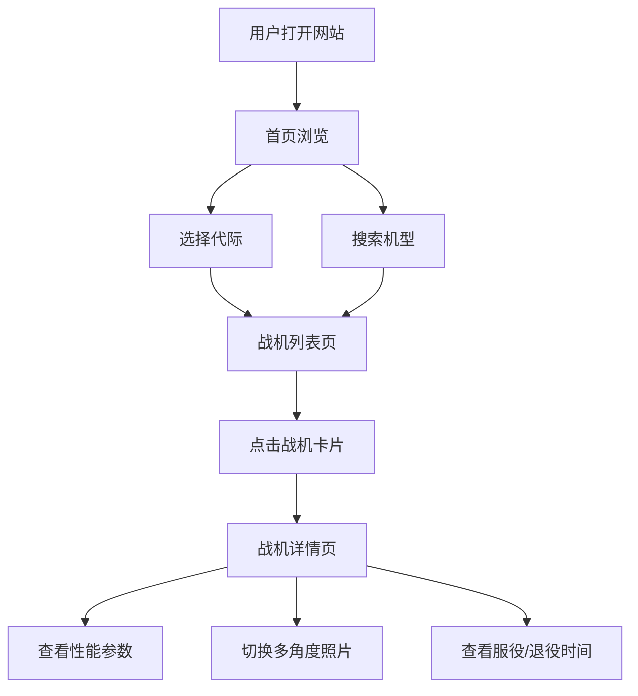

# 战斗机图鉴网站 - 产品需求文档

## 1. 产品概述

一个展示从第一代到第六代主流战斗机的图鉴网站，用户可以按机型搜索或按代际浏览，查看每种战斗机的详细性能参数和多角度照片。

- **目标用户**：军事爱好者、航空爱好者、研究人员
- **核心价值**：一站式了解各代战斗机的关键信息，支持快速检索和对比

## 2. 核心功能

### 2.1 用户角色
| 角色 | 访问方式 | 核心权限 |
|------|----------|----------|
| 访客 | 直接访问 | 浏览所有战机信息、搜索、筛选 |

### 2.2 功能模块
1. **首页**：英雄区展示、代际导航、热门战机推荐
2. **战机列表页**：按代际筛选、搜索、卡片展示
3. **战机详情页**：完整参数、多角度照片、服役信息
4. **搜索功能**：支持按机型名称搜索和按代际筛选

### 2.3 页面详情
| 页面名称 | 模块名称 | 功能描述 |
|----------|----------|----------|
| 首页 | 英雄区 | 震撼的标题和简介，代际选择入口 |
| 首页 | 代际导航 | 6个代际卡片，点击跳转对应列表 |
| 首页 | 热门战机 | 精选几款代表性战机的卡片展示 |
| 战机列表页 | 筛选栏 | 代际筛选按钮组 + 搜索输入框 |
| 战机列表页 | 战机卡片网格 | 展示战机缩略图、名称、代际、关键参数摘要 |
| 战机详情页 | 基本信息区 | 名称、代际、国家、制造商、服役时间、退役时间（如适用） |
| 战机详情页 | 性能参数表 | 最大巡航速度、最大带弹量、重量、转弯半径等关键参数 |
| 战机详情页 | 多角度照片区 | 俯视图、侧视图、前视图等多角度照片展示，支持切换 |
| 全局 | 导航栏 | 网站标题、返回首页、搜索入口 |

## 3. 核心流程

用户打开网站 → 浏览首页代际导航 → 选择代际或搜索机型 → 查看战机列表 → 点击战机卡片 → 查看详细信息和多角度照片

## 4. 用户界面设计

### 4.1 设计风格
- **色调**：深色系主题，以深灰/藏青为底色，搭配军绿色和橙红色作为强调色，营造军事航空氛围
- **按钮**：圆角适中，带微弱边框光效，hover时有发光效果
- **字体**：标题使用粗犷的军事风格字体（如 Orbitron），正文使用清晰易读的无衬线字体
- **布局**：卡片式布局，顶部导航，网格展示
- **图标**：简洁的线性图标，与军事主题呼应

### 4.2 页面设计概览
| 页面名称 | 模块名称 | UI元素 |
|----------|----------|--------|
| 首页 | 英雄区 | 全屏暗色背景，大标题渐入动画，代际入口按钮组，布局：居中对称，配色：深色+橙红强调，字体：Orbitron |
| 首页 | 代际导航 | 6个横向卡片，hover时上浮+发光，布局：flex/grid响应式 |
| 战机列表页 | 筛选栏 | 代际标签按钮组 + 搜索输入框，布局：顶部固定或吸顶 |
| 战机列表页 | 战机卡片网格 | 卡片含缩略图、名称、代际标签、2-3个关键参数，布局：响应式网格 |
| 战机详情页 | 基本信息区 | 大标题、代际徽章、国家/制造商、服役时间线，布局：左侧信息右侧主图 |
| 战机详情页 | 性能参数表 | 表格或参数卡片组，含图标+数值+单位，布局：双列网格 |
| 战机详情页 | 多角度照片区 | 缩略图导航+大图展示，支持点击切换角度，布局：下方缩略图上方大图 |

### 4.3 响应式设计
- 桌面端优先设计，平板和移动端自适应
- 卡片网格：桌面3-4列，平板2列，手机1列
- 触摸优化：按钮和可点击区域足够大

### 4.4 性能参数定义
| 参数 | 说明 | 单位 |
|------|------|------|
| 最大巡航速度 | 飞机能持续保持的最大飞行速度 | 马赫 / km/h |
| 最大带弹量 | 最大武器挂载能力 | kg |
| 最大起飞重量 | 飞机最大起飞时的总重量 | kg |
| 空重 | 飞机无载荷时的重量 | kg |
| 作战半径 | 执行作战任务的最大往返距离 | km |
| 实用升限 | 飞机能达到的最大实用飞行高度 | m |
| 爬升率 | 每分钟上升的高度 | m/min |
| 机长 | 飞机总长度 | m |
| 翼展 | 机翼展开宽度 | m |
| 机高 | 飞机总高度 | m |
| 服役时间 | 首次正式服役的年份/日期 | 年 |
| 退役时间 | 正式退役的年份/日期（如已退役） | 年 |
