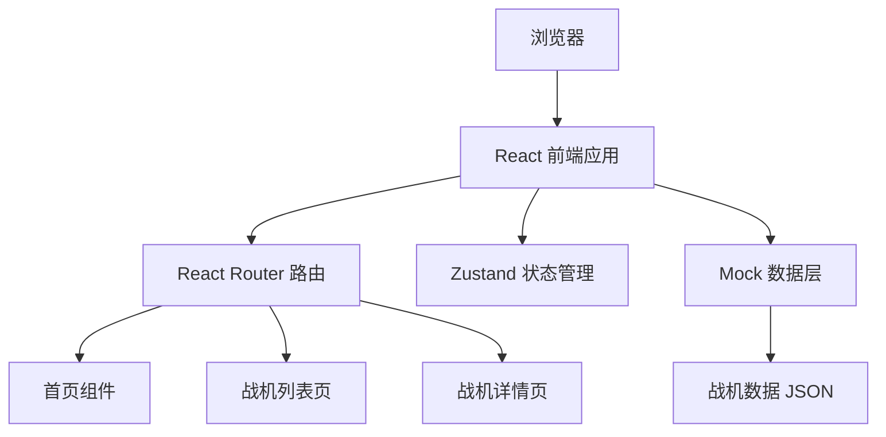

# 战斗机图鉴网站 - 技术架构文档

## 1. 架构设计



## 2. 技术栈

- **前端**: React 18 + TypeScript + Vite
- **样式**: Tailwind CSS 3
- **状态管理**: Zustand
- **路由**: React Router DOM
- **图标**: lucide-react
- **数据**: 本地 Mock JSON 数据（后续可替换为 API）

## 3. 路由定义

| 路由 | 说明 |
|------|------|
| `/` | 首页 - 代际导航和热门战机展示 |
| `/aircraft` | 战机列表页 - 按代际筛选和搜索 |
| `/aircraft/:id` | 战机详情页 - 完整参数和多角度照片 |

## 4. 数据模型

### 4.1 战机数据模型定义

```mermaid
erDiagram
    AIRCRAFT {
        string id PK
        string name
        string generation
        string country
        string manufacturer
        string first_flight
        string service_entry
        string退役_date
        string status
        string description
    }
    PERFORMANCE {
        string aircraft_id FK
        number max_speed
        number max_payload
        number max_takeoff_weight
        number empty_weight
        number combat_radius
        number service_ceiling
        number climb_rate
        number length
        number wingspan
        number height
    }
    PHOTOS {
        string aircraft_id FK
        string front_view
        string side_view
        string top_view
        string additional_views
    }
    AIRCRAFT ||--o| PERFORMANCE : has
    AIRCRAFT ||--o| PHOTOS : has
```

### 4.2 TypeScript 类型定义

```typescript
interface Aircraft {
  id: string;
  name: string;
  generation: 1 | 2 | 3 | 4 | 5 | 6;
  country: string;
  manufacturer: string;
  firstFlight: string;
  serviceEntry: string;
 退役Date?: string;
  status: '服役中' | '已退役' | '研发中';
  description: string;
  performance: Performance;
  photos: Photos;
}

interface Performance {
  maxSpeed: string;        // 最大巡航速度 (马赫/km/h)
  maxPayload: string;      // 最大带弹量 (kg)
  maxTakeoffWeight: string; // 最大起飞重量 (kg)
  emptyWeight: string;     // 空重 (kg)
  combatRadius: string;    // 作战半径 (km)
  serviceCeiling: string;  // 实用升限 (m)
  climbRate: string;       // 爬升率 (m/min)
  length: string;          // 机长 (m)
  wingspan: string;        // 翼展 (m)
  height: string;          // 机高 (m)
}

interface Photos {
  frontView: string;
  sideView: string;
  topView: string;
  additionalViews: string[];
}
```

### 4.3 初始数据示例

将预置各代代表性战机的 Mock 数据：

**第一代**: F-86、米格-15
**第二代**: F-4、米格-21、歼-7
**第三代**: F-14、F-15、F-16、苏-27、歼-8
**第四代**: F/A-18E/F、阵风、台风、歼-10、歼-16
**第五代**: F-22、F-35、歼-20、歼-35、苏-57
**第六代**: NGAD（概念）

## 5. 项目目录结构

```
aircraft-collection/
├── .trae/documents/          # 文档目录
│   ├── fighter-jets-prd.md
│   └── technical-architecture.md
├── src/
│   ├── components/           # 可复用组件
│   │   ├── Header.tsx        # 顶部导航栏
│   │   ├── AircraftCard.tsx  # 战机卡片组件
│   │   ├── GenerationNav.tsx # 代际导航组件
│   │   ├── PhotoGallery.tsx  # 照片画廊组件
│   │   ├── PerformanceTable.tsx # 性能参数表
│   │   └── SearchBar.tsx     # 搜索栏组件
│   ├── pages/                # 页面组件
│   │   ├── HomePage.tsx      # 首页
│   │   ├── AircraftList.tsx  # 战机列表页
│   │   └── AircraftDetail.tsx # 战机详情页
│   ├── data/                 # Mock 数据
│   │   └── aircraftData.ts   # 战机数据
│   ├── store/                # 状态管理
│   │   └── aircraftStore.ts  # Zustand store
│   ├── types/                # 类型定义
│   │   └── index.ts          # TypeScript 类型
│   ├── App.tsx               # 根组件
│   └── main.tsx              # 入口文件
├── package.json
├── tsconfig.json
├── vite.config.ts
├── tailwind.config.js
└── postcss.config.js
```
